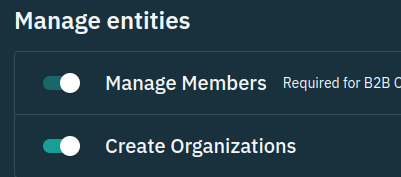

# Stytch Vanilla JavaScript example application

<p align="center">
  
</p>

## Overview

This example application demonstrates how one may use Stytch within a Vanilla B2B JavaScript application, forked from Stytch's [Vanilla JavaScript Example](https://github.com/stytchauth/stytch-javascript-example). There is a wide ecosystem of tools for building and serving JavaScript web apps each with their own implementation style and flavor. For that reason, this example is unopinionated and does not use additional tooling other than HTML, CSS, and Stytch's Vanilla B2B JavaScript SDK. The entire application is served out of the `public` directory using [`http-server`](https://www.npmjs.com/package/http-server).

This project uses Stytch's [JavaScript B2B SDK](https://stytch.com/docs/b2b/sdks/javascript-sdk) which provides pre-built UI components and headless methods to securely interact with Stytch.

This application features Email Magic Links and Google OAuth for authentication, as well as Stytch's Sessions Management product to manage user sessions. You can use this application's source code as a learning resource, or use it as a jumping off point for your own project. 

## Set up

Follow the steps below to get this application fully functional and running using your own Stytch credentials.

### In the Stytch Dashboard

1. Create a [Stytch](https://stytch.com/) account. Once your account is set up a Project called "My first project" will be automatically created for you.

2. Within your new Project, navigate to [SDK configuration](https://stytch.com/dashboard/sdk-configuration), and make the following changes:

   - Click **Enable SDK**.
   - Under **Authorized environments** add the domain `http://localhost:5000`.

     

   - Under **Manage entities** toggle on **Manage Members** and **Create Organizations**.

     

   - Under **Authentication products** toggle on **Email Magic Links** and **OAuth**.

     


3. Navigate to [Redirect URLs](https://stytch.com/dashboard/redirect-urls), and add `http://localhost:5000` for **All** types.

   

4. Navigate to [OAuth](https://stytch.com/dashboard/oauth), and set up login for Google in the Test environment. Follow all the instructions provided in the Dashboard. If you are not interested in OAuth login you can skip this step. However, the _Continue with Google_ button in this application will not work.

   

5. Finally, navigate to [API Keys](https://stytch.com/dashboard/api-keys), and copy your `public_token`. You will need this value later on.

### On your machine

In your terminal clone the project and install dependencies:

```bash
git clone https://github.com/adrian-bootstrap/stytch-javascript-b2b-example.git
cd stytch-javascript-b2b-example
npm i
```

Next, open the file [`public/js/app.js`](./public/js/app.js) and replace the value assigned to the constant `STYTCH_PUBLIC_TOKEN` with your `public_token`.
```js
const STYTCH_PUBLIC_TOKEN = "public-token-test-123abcd-1234-1234-abcd-123123abcabc";
``` 

## Running locally

After completing all the set up steps above the application can be run with the command:

```bash
npm run dev
```

The application will be available at [`http://localhost:5000`](http://localhost:5000).

You'll be able to login with Email Magic Links or Google OAuth and see your Stytch User object, Stytch Session, and see how logging out works.

## Next steps

This example app showcases a small portion of what you can accomplish with Stytch. Here are a few ideas to explore:

1. Add additional login methods like Passwords.
2. Replace the pre-built UI with your own using by using the SDK's [headless methods](https://stytch.com/docs/b2b/sdks/javascript-sdk).
3. Secure your app further by building MFA authentication using methods like [One-time passcodes (OTP) for MFA](https://stytch.com/docs/b2b/sdks/javascript-sdk/otps).
4. Use [Stytch Sessions](https://stytch.com/docs/b2b/api/authenticate-session) to secure your backend.

## Get help and join the community

#### :speech_balloon: Stytch community Slack

Join the discussion, ask questions, and suggest new features in Stytch's ​[Slack community](https://join.slack.com/t/stytch/shared_invite/zt-nil4wo92-jApJ9Cl32cJbEd9esKkvyg)!

#### :question: Need support?

Check out the [Stytch Forum](https://forum.stytch.com/) or email [support@stytch.com](mailto:support@stytch.com).
